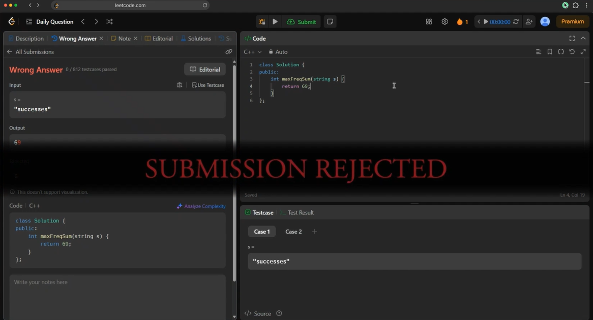

# Elden Ring LeetCode Extension

Enhance your LeetCode experience with GTAV–inspired notifications and achievements.



## Installation

1. Clone this repository
2. Install dependencies:

   ```bash
   npm install
   ```
3. Build the extension:

   ```bash
   npm run build
   ```

## Loading the Extension

1. Open Chrome and navigate to `chrome://extensions/`
2. Enable **Developer mode** (top-right toggle)
3. Click **Load unpacked**
4. Select the `dist` directory from this project

## Features

* GTAV–styled notifications for LeetCode submissions
* Achievement system for coding milestones
* Immersive, game-inspired UI elements

## Contributing

Contributions are welcome. Please submit issues or enhancement requests.

## Credits

Inspired by [this X post](https://x.com/saltyAom/status/1966608243167555734).
